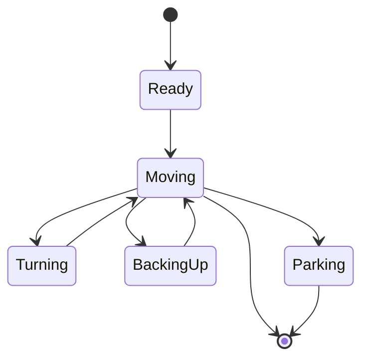

# RocheReapers Future Engineers Team

  

This repository contains all the code and documentation of the WRO Team `RocheReapers`

**Team Members:**
* [Robin Küttel](https://github.com/Robinkuet1): [robinkuettel@gmail.com](mailto:robinkuettel@gmail.com) 
* [Guilherme Vercillo Fortes](https://github.com/vercillg)
* [Mischa Fässler](https://github.com/ShrekIL)

**Coach:**
* Cyril Odermatt

## Description of the developed solution

### 1. Problem Statement and Goal
The goal of the competition is to develop an autonomous vehicle that can complete two challenges:

- Open Challenge: Three laps on a area of known size, but with a obstacle of unknown dimensions in the center.

- Obstacle Challenge: Three laps with colored obstacles and a parallel parking maneuver in a parking zone on a 3x3 area.

---

### 2. Hardware Overview
The vehicle is based on the Hiwonder MentorPi A1.

#### Hardware changes
We made the following hardware changes:
- To comply with WRO rules, one motor was removed, so the drive is now powered by a single motor mechanically coupled to a LEGO differential gear
- The originally installed 3D camera was replaced with an Intel RealSense D435i to achieve a better performance. The brightness/colors of the original camera were too upredictable and thus not well suited for computer vision
- The LiDAR sensor was relocated to the front of the vehicle, as the walls are only 10cm high. So the lidar is now at about 5cm above ground, for the highest possible chance to detect all the visible walls.
- A 9dof imu (Inertial Measurement Unit) was added, that is used for odometry
- 2 distance ultrasound distance sensors were added at the back. They area also used for odometry
- A simple push button was added to start the robot

#### Dimensions

#### Lidar mounting
At first we tried to mount the lidar using hot glue. This didn't work well.
Due to the walls only beeing 10cm high and the lidar beeing mounted 5cm from the ground, we had 5cm of tolerance on a 3m distance.
If we calculate the anlge tolerance with trigonometry we get the following:

$sin(Tolerance) * 3 = 0.05m$

If we solve this equation we arrive at:

$Tolerance\approx +-0.9549\textdegree$

We realized, that this is basically impossible to acchieve with hot glue, we decided to design our own mounting mechanism.
For this we 3d printed a mount, that can be adjusted using 3 screws.

See following picture:

**TODO** insert picture

#### Lego differential

---

### 3. Software Overview

Our software is based on states based on simple rules.
See the state machine section for more info.

#### State Machine

**Explanation of the states**:

**Ready**: The state right after powering the robot on. It waits and does nothing until the start button is pressed. Then the robot switches to the moving state.

**Moving**: This is the main state of the robot. Here the robot just uses the lidar data to move around the 3x3 area.
It is also counting its laps.

#### Driving Strategy and Path Planning

For the Path Planning we used an approach based on the paper "The Dynamic Window Approach to Collision Avoidance"[1].

[1]: https://www.ri.cmu.edu/pub_files/pub1/fox_dieter_1997_1/fox_dieter_1997_1.pdf

#### Obstacle detection with OpenCV

---

### 6. Technical Challenges & Solutions
- Rule-Compliant Drive: Modified the MentorPi A1 to use a single drive motor with a LEGO differential gear.
