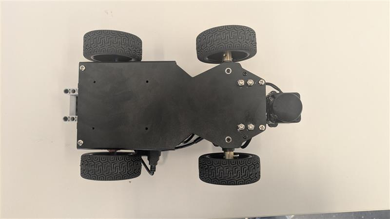

# RocheReapers Future Engineers Team

  

This repository contains all the code and documentation of the WRO Team `RocheReapers`

**Team Members:**
* [Robin Küttel](https://github.com/Robinkuet1): [robinkuettel@gmail.com](mailto:robinkuettel@gmail.com) 
* [Guilherme Vercillo Fortes](https://github.com/vercillg)
* [Mischa Fässler](https://github.com/ShrekIL)

**Coach:**
* Cyril Odermatt

## Description of the developed solution

### 1. Problem Statement and Goal
The goal of the competition is to develop an autonomous vehicle that can complete two challenges:

- Open Challenge: Three laps on a area of known size, but with a obstacle of unknown dimensions in the center.

- Obstacle Challenge: Three laps with colored obstacles and a parallel parking maneuver in a parking zone on a 3x3 area.
  - When red obstacle => turn right
  - When green obstacle => turn left
  - Parking zone colored with magenta

---

### 2. Hardware Overview
The vehicle is based on the Hiwonder MentorPi A1.

#### Vehicle Photos

Below are the required vehicle images from different perspectives as per the WRO documentation requirements.

  
  
  
  
  
  

#### Hardware changes
We made the following hardware changes:
- To comply with WRO rules, one motor was removed, so the drive is now powered by a single motor mechanically coupled to a LEGO differential gear. It also had to be stabilised with a lego construct for exact power output to the rear wheels.
- The originally installed 3D camera was replaced with an Intel RealSense D435i to achieve a better performance. The brightness/colors of the original camera were too upredictable and thus not well suited for computer vision
- The LiDAR sensor was relocated to the front of the vehicle, as the walls are only 10cm high. So the lidar is now at about 5cm above ground, for the highest possible chance to detect all the visible walls.
  - Due to the repositioning of the LiDAR sensor, the camera's mounting height also had to be adjusted to maintain an unobstructed field of view. This was achieved by slightly elevating the camera using a custom riser.
- The standard servo motor responsible for steering was replaced with a Power HD LW-15MG (waterproof) to significantly improve performance. The upgrade increased the control frequency from the standard 50 Hz to 333 Hz, resulting in faster and more precise steering response.
- A simple push button was added to start the robot

#### Dimensions

| Parameter | Value              |
|----------:|--------------------|
| Weight    | 1.2 kg (on 3 attempts) |
| Height    | 16.5 cm            |
| Length    | 28 cm              |
| Width     | 16.5 cm            |

#### Lidar mounting
At first we tried to mount the lidar using hot glue. This didn't work well.
Due to the walls only beeing 10cm high and the lidar beeing mounted 5cm from the ground, we had 5cm of tolerance on a 3m distance.
If we calculate the anlge tolerance with trigonometry we get the following:

$sin(Tolerance) * 3 = 0.05m$

If we solve this equation we arrive at:

$Tolerance\approx +-0.9549\textdegree$

We realized, that this is basically impossible to achieve with hot glue, we decided to design our own mounting mechanism.
For this we 3d printed a mount, that can be adjusted using 3 screws.

See following picture:

  
  
  
  

With this, we were now able to accurately callibrate the lidar.

#### Lego differential gearbox

Since the vehicle is now powered by a single motor, the use of a differential gearbox was essential. This allows the rear wheels to rotate at different speeds during turns, improving the robot's maneuverability and stability. The Lego construction was also stabilized to ensure precise and even power transmission to both rear wheels.

See following picture:

  
  

#### Sensor Overview
| Component        | Type/Model               | Position on Robot          | Function                                  |
|------------------|--------------------------|----------------------------|-------------------------------------------|
| 3D Camera        | Intel RealSense D435i    | Front (raised mount)       | Color detection (OpenCV), depth sensing   |
| LiDAR            | STL-19P TOF Lidar        | Front, 5 cm above ground   | Obstacle/wall detection, navigation       |
| Steering Servo   | Power HD LW-15MG         | Front axle                 | Controls steering (PWM, 333 Hz)           |
| Drive Motor      | Hiwonder DC Motor        | Rear, center               | Drives the vehicle via LEGO differential  |
| Start Button     | Generic Push Button      | Top back right of chassis  | Starts the program                        |

---

### 3. Software Overview

Our software works based on states that follow simple rules.

See the following diagram for an overview of the possible states:

**Explanation of the states**:

**Ready**: The state right after powering the robot on. It waits and does nothing until the start button is pressed. Then the robot switches to the moving state.

**Moving**: This is the main state of the robot. In this state the robot just uses the lidar data to move around the 3x3 area.
In case a obstace is detected, the robot automatically starts turning into the direction corresponding to the color of the obstacle.
In case a obstace is detected, the robot automatically starts turning into the direction corresponding to the color of the obstacle.
Whenever the distance of the robot to a wall in front gets below a certain threshold, it changes to the turning state.
Whenever the distance of the robot to a obstacle gets below a certain threshold,  
Whenever the distance of the robot to a obstacle gets below a certain threshold,  

**Turning**: In this state, the robot is turning in to the direction, where the wall is farther away.
As soon as the angle to the wall at the side and the front is close to 90deg, the state changes back to Moving.

**BackingUp**: In this state, the robot will try to move away from an obstacle while trying to turn a bit, so it is easier to pass the obstace when driving forward again.

#### Obstacle detection with OpenCV

**Goal**

To provide the robot with the capability to visually identify and locate red and green blocks, specifically for the **Obstacle Challenge.**  
This supplements the LiDAR-based navigation used in the **Open Challenge** by adding color-based object recognition.

**Why OpenCV for this Task?**

**Color as a Key Feature**

The challenge involves colored obstacles. OpenCV allows us to easily isolate objects based on their color, providing a direct and efficient way to identify the target blocks.

**Complementary Sensing**  
While LiDAR excels at distance measurement and obstacle avoidance, OpenCV provides semantic information about the type of obstacle (based on color).  
Combining these sensor inputs allows for a more nuanced understanding of the environment.

**Flexibility for Future Expansion**

OpenCV is a versatile library. While currently used for color detection, it could be extended in the future for more complex visual tasks like shape recognition or object tracking if the competition rules evolve.

**How it Integrates with the Robot's Software**

The OpenCV-based obstacle detection likely operates as a module within the robot's overall software architecture. It would:

- **Process Images from the RealSense Camera:**
  The RealSense D435i, chosen for its improved color accuracy, provides the visual data that OpenCV analyzes.

- **Identify Red and Green Regions:** 
  Using the techniques described earlier (color space conversion, thresholding), OpenCV identifies areas in the image that match the defined red and green color ranges.

- **Locate and Characterize Blocks:** 
  By finding the contours of these colored regions, OpenCV can determine the position (in the image) and size of potential blocks. The color of each detected block can also be determined based on the dominant color within its contour.

- **Provide Information to the Robot's State Machine:**  
  The information about the detected blocks (their color, position, and size) is then likely passed to the robot's state machine.  
  This allows the robot to make decisions and transition between states based on what it "sees."  
  For example, upon detecting a green block in a specific area, the robot might initiate the parallel parking maneuver.

**Synergy with Other Sensors**

It’s important to note how the OpenCV-based detection works in conjunction with the LiDAR:

- **LiDAR for General Obstacle Avoidance:**  
  The LiDAR likely handles the primary task of navigating the 3×3 area and avoiding any unforeseen obstacles during both challenges.

- **OpenCV for Color-Specific Tasks:**  
  When the **"Obstacle Challenge"** requires interaction with colored blocks, OpenCV provides the necessary color identification capability that LiDAR alone cannot offer.

---

By integrating OpenCV for color-based object detection with the LiDAR for spatial awareness, the **RocheReapers' robot** gains a more comprehensive understanding of its environment, enabling it to tackle the complexities of both competition challenges effectively.

#### Development Tools & Libraries/SDKs

**Development Tools:**

- **VS Code:** A widely used, free, and extensible code editor utilized for various programming languages and development tasks.

- **PyCharm:** A dedicated Integrated Development Environment (IDE) specifically designed for Python development, offering advanced features for coding assistance, debugging, testing, and project management.

- **Git:** A distributed version control system frequently used in software development to manage code changes and facilitate team collaboration. VS Code, for example, offers good integration with Git.

- **GitHub:** A web-based hosting service for version control using Git that provides collaboration features such as bug tracking, feature requests, task management, and continuous integration. Used for sharing and collaborating on the robot's codebase.

- **Intel RealSense Viewer:** A graphical tool for visualizing and configuring Intel RealSense depth cameras. It enables the display of depth, color, and infrared data, as well as the adjustment of camera settings.

- **ROS (Robot Operating System):** A flexible framework for writing robot software. It provides a collection of tools, libraries, and conventions that aim to simplify the task of creating complex and robust robot behavior across a wide variety of robotic platforms. ROS often integrates with sensors like the Intel RealSense cameras.

- **CMake:** A cross-platform build system used to control the software compilation process using simple platform and compiler independent configuration files. It generates native makefiles and workspaces that can be used in the compiler environment of your choice.

- **Linux:** A family of open-source Unix-like operating systems. It is known for its flexibility, customizability, and use in various applications, including development and server environments.

- **Windows:** A series of graphical operating systems developed by Microsoft. It is widely used on personal computers and in enterprise environments.

- **RealVNC Viewer:** A software application that allows you to control a remote computer over the network (can be used for remote development or accessing development environments).

**Libraries/SDKs:**

- **Python:** A popular, versatile, and interpreted programming language employed in numerous application areas, ranging from web development and data analysis to artificial intelligence. (Often used with various libraries for specific tasks).

- **pytest:** A framework for writing small to complex functional testing for Python applications. Used for automated testing of components.

- **Library (Lib):** In the context of software, a library is a collection of pre-written code that developers can use to add specific functionalities to their applications without having to write the code from scratch. For Python and RealSense, pyrealsense2 would be an example of such a library.

- **Intel SDK (Software Development Kit):** A comprehensive set of tools, libraries, documentation, code samples, and processes that allow developers to create software applications for Intel hardware and technologies. In the context of Intel RealSense, this would refer to the **Intel RealSense SDK (librealsense)**, which enables interaction with the cameras.

### Videos

TODO